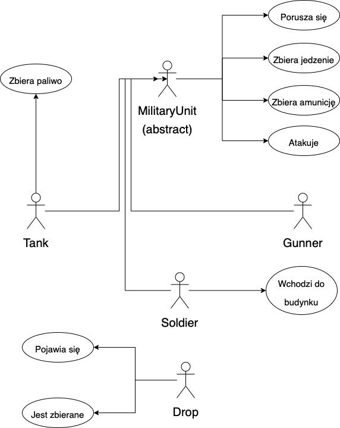
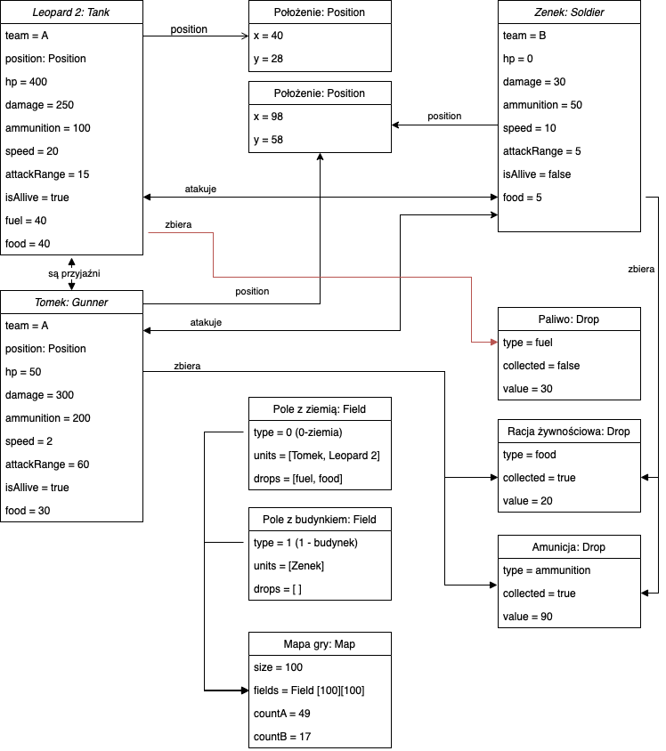

# Inferno Project
Dokumentacja projektu z Programowania Obiektowego, ITE 2022, PWR.

Temat projektu: **Symulacja wojennego pola walki**

Autorzy: **Michał Kaźmierczak** i **Jacek Bogdański**

## Obiekty: 
    1. Czołg / Tank
    2. Piechur / Soldier
    3. Artylerzysta / Gunner
    4. Amunicja / Ammunition
    5. Paliwo / Fuel
    6. Racja żywnościowa / Food Ration

# Opis symulacji: 

Na polu walki znalazły się siły dwóch przeciwnych narodów, każda jednostka jest zdana na samą siebie, nie obowiązuje żadna taktyka. Ilość jednostek poszczególnej drużyny zależy od wprowadzonych danych początkowych (z założeniami maksymalnymi). Maksymalna liczba jednostek zależy od wielkości mapy.

Jednostki odległości są określone względem maksymalnej odległości strzału (widoczność), niezależnej od wielkości mapy.

# Integracje:

Czołg porusza się umiarkowanie szybko i strzela do wszystkich przeciwników znajdujących się w dużej odległości, zbiera racje żywnościowe, amunicję i paliwo.

Piechur porusza się wolno, strzela na małą odległość, zbiera racje żywnościowe i amunicję. Może wejść do budynku.

Artylerzysta porusza się najwolniej, strzela na największą odległość, zbiera racje żywnościowe i amunicję.

Na mapę losowo zrzucane są regularnie racje żywnościowe, amunicja oraz zapasy paliwa.

Amunicja jest konieczna do oddawania strzałów, bez amunicji możliwa jest tylko walka zbliżeniowa.

Paliwo jest konieczne, aby czołg mógł się poruszać, w przeciwnym wypadku będzie strzelał, ale nie będzie się poruszał (aż paliwo nie zostanie zrzucone w jego otoczeniu). 

Racje żywnościowe są konieczne, aby jednostki miały siłę do poruszania się i walki, w przypadku długiego braku jedzenia parametry zostają obniżone.

W budynku może schować się piechur, nie jest wtedy widoczny dla innych przeciwników. Inne jednostki nie mogą stanąć na tym polu.

# Diagram przypadków użycia

Klasy Tank, Soldier, Gunner dziedziczą po klasie Military Unit, która implementuje interfejs Movable. Obiekty tych klas są zdolne do poruszania się, zbierania określonych zasobów (dropów) oraz atakowania jednostek drużyny przeciwnej. Jednostki tej samej drużyny są wobec siebie neutralne. Dodatkowo obiekty klasy Soldier mogą wejść do budynku, w których są bezpieczne - nie mogą być zaatakowane przez obiekty poza budynkiem. 
Klasa Drop implementuje interfejs Pickable.

# Diagram obiektów

Najważniejszym obiektem jest obiekt Map, który łączy wszystkie dane symulacji. Zawiera dwuwymiarową tablicę mapy, która przechowuje informacje o rodzaju pola i znajdujących się na ich obiektach. Każdemu obiektowi przypisany jest obiekt Position, wskazujący jego aktualną pozycję na mapie. Obiekty poruszające się pojawiają się na mapie na pozątku symulacji, natomiast Dropy pojawiają się na mapie losowo wraz z postępem symulacji. Czołgi podnoszą paliwo i amunicję, żołnierze podnoszą jedzenie i amunicję, uzupełniając swoje zapasy, natomiast artylerzyści podnoszą tylko amunicję. W przedstawionej sytuacji czołg Leopard 2 jest sojusznikiem artylerzysty Tomka. Artylerzysta walczy z żołnierzem Zenkiem, stoją na tym samym polu, natomiast czołg Leopard 2 znajduje się zbyt daleko, żeby prowadzić atak.
